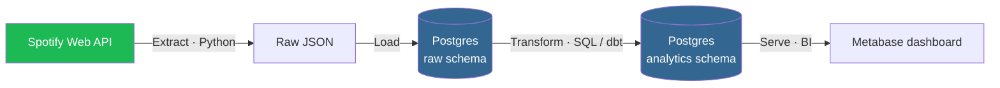
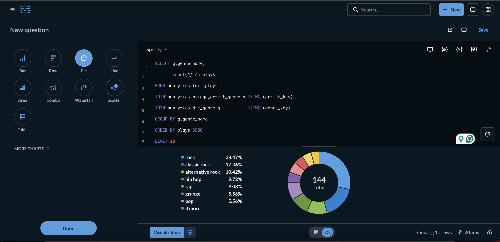

# spotify-elt-pipeline

> An ELT pipeline that extracts personal listening data from the Spotify Web API, lands it raw in Postgres, and transforms it into an analytics-ready data model.


> **Status:** ✅ v1 complete — ELT runs end to end (Extract → Load → dbt Transform), with a tested star schema and a one-command pipeline. See the [Roadmap](#roadmap).

---

## Overview

This project answers a simple question with a real data engineering workflow: **what do my listening habits actually look like over time?**

It's built as an **ELT** pipeline rather than ETL — raw data is loaded into Postgres first, then transformed *inside* the warehouse with SQL. This mirrors how modern analytics stacks work (load cheap, transform in-warehouse, keep raw data replayable) and keeps the extraction layer dumb and reliable.

The whole stack runs locally via Docker Compose, so it can be cloned and stood up with a single command.

## Architecture



**Extract** — Python client pulls endpoints like recently-played tracks, top tracks/artists, and audio features.
**Load** — raw API responses land in a `raw` schema with minimal processing, so extraction never loses data and is fully replayable.
**Transform** — SQL/dbt models clean and reshape the raw data into a dimensional model (`dim_track`, `dim_artist`, `fact_plays`).
**Serve** — analytics tables ready for queries, notebooks, or a dashboard.

## Tech Stack

| Layer | Tool | Why |
|---|---|---|
| Extraction | Python 3.11 | Spotify API client, scheduling glue |
| Storage / Warehouse | Postgres 15 | Reliable, SQL-native, easy to run in Docker |
| Transformation | dbt 1.10 (postgres) | Versioned, tested, modular SQL — star schema + 39 data tests |
| BI / Serving | Metabase | No-code dashboards on the star schema |
| Infrastructure | Docker Compose | Reproducible local environment |
| Orchestration | cron (`run_pipeline.sh`) → Airflow/Dagster *(later)* | Scheduled, observable runs |

## Data Model

A **star schema** built with dbt in the `analytics` schema:

- `fact_plays` — one row per play event (FKs → track / artist / date; `duration_ms`, `play_count`)
- `dim_track` — track + album attributes
- `dim_artist` — artists, with a convenience `primary_genre`
- `dim_genre` — distinct cleaned genres (from Last.fm tags)
- `dim_date` — calendar date dimension
- `bridge_artist_genre` — many-to-many artist ↔ genre

Staging views (`stg_*`) flatten the raw JSONB and an intermediate model
(`int_artist_genres`) cleans the messy Last.fm folksonomy tags (denylist seed +
regex). Raw DDL lives in [`sql/ddl/`](sql/ddl/); the dbt project lives in
[`dbt/`](dbt/). Full walkthrough: [`docs/phase-3-deep-dive.md`](docs/phase-3-deep-dive.md).

## Insights

Sample analytics over the current ~50-play dataset (full set in
[`docs/insights.md`](docs/insights.md); queries in [`sql/analysis/`](sql/analysis/)):



*Top genres by play count, served from the `analytics` star schema in Metabase.*

| genre | plays |          | artist | plays |
|---|---|---|---|---|
| rock | 30 |  | Creedence Clearwater Revival | 4 |
| classic rock | 17 |  | Foo Fighters | 2 |
| hip hop | 12 |  | Nipsey Hussle | 2 |
| alternative rock | 12 |  | Larry June | 2 |
| rap | 11 |  | The Doors | 2 |

The sample spans **seven decades** of release dates (1960s–2020s) and **3.3 hours**
of listening across 49 distinct tracks.

## Project Structure

```
spotify-elt-pipeline/
├── docker-compose.yml      # Postgres (warehouse) + Metabase (BI)
├── run_pipeline.sh         # extract+load -> dbt build (cron-friendly)
├── .env.example            # template for required env vars (no secrets)
├── requirements.txt
├── src/
│   ├── extract/            # Spotify + Last.fm API clients
│   ├── load/               # land raw responses in Postgres
│   └── transform/          # notes (dbt project lives in dbt/)
├── dbt/                    # dbt project: staging -> intermediate -> marts
│   ├── models/             # stg_*, int_*, dim_*, bridge_*, fact_plays
│   └── seeds/              # non_genre_tags.csv (denylist)
├── sql/
│   ├── ddl/                # raw schema + table definitions
│   └── analysis/           # sample analytics queries
├── docs/                   # deep-dives, insights, resume notes
├── tests/
└── README.md
```

## Getting Started

### Prerequisites
- [Docker Desktop](https://www.docker.com/products/docker-desktop/) — or, on macOS that predates Docker Desktop's requirements, [Colima](https://github.com/abiosoft/colima) (`brew install colima docker docker-compose`, then `colima start`). The `docker` / `docker compose` commands below work the same either way.
- Python 3.11+
- A [Spotify Developer app](https://developer.spotify.com/dashboard) (free) for your Client ID and Secret

### Setup

```bash
# 1. Clone
git clone https://github.com/<your-username>/spotify-elt-pipeline.git
cd spotify-elt-pipeline

# 2. Configure secrets (never committed — .env is gitignored)
cp .env.example .env
# then edit .env and fill in your Spotify + Postgres values

# 3. Start Postgres
docker compose up -d

# 4. Verify the database is up
docker compose exec postgres psql -U postgres -c "SELECT 1;"
```

### Environment variables

Copy `.env.example` to `.env` and fill in:

```env
SPOTIFY_CLIENT_ID=your_client_id
SPOTIFY_CLIENT_SECRET=your_client_secret
SPOTIFY_REFRESH_TOKEN=your_refresh_token   # added once OAuth is set up

POSTGRES_USER=postgres
POSTGRES_PASSWORD=postgres
POSTGRES_DB=spotify
POSTGRES_PORT=5432
```

> 🔒 `.env` is gitignored. Only `.env.example` (with placeholder values) is committed.

## Roadmap

**Phase 1 — Foundation** ✅
- [x] Postgres 15 running via Docker Compose
- [x] Repo + `.gitignore` + `.env.example` scaffolding
- [x] Spotify developer app registered, credentials in `.env`
- [x] `SELECT 1` succeeds against the container

**Phase 2 — Extract & Load** ✅
- [x] OAuth flow to obtain a refresh token
- [x] Python client pulling recently-played + Last.fm artist tags (genre proxy)
- [x] Raw responses landing in the `raw` schema (idempotent)

**Phase 3 — Transform** ✅
- [x] dbt project (`dbt/`) modeling `raw` → `analytics`
- [x] Star schema: `fact_plays` + `dim_track`/`dim_artist`/`dim_genre`/`dim_date` + `bridge_artist_genre`
- [x] Last.fm folksonomy tag cleaning (denylist seed + regex)
- [x] 39 dbt data tests (not_null / unique / relationships) passing

**Phase 4 — Operate & Present** ✅
- [x] One-command pipeline (`run_pipeline.sh`: extract+load → `dbt build`)
- [x] Scheduled daily via cron (PATH-hardened, Colima auto-start)
- [x] Real test suite (`pytest`): Last.fm client units + loader idempotency integration
- [x] dbt docs / lineage (`dbt docs generate`)
- [x] Sample insights ([`docs/insights.md`](docs/insights.md))
- [x] BI dashboard via Metabase ([setup guide](docs/metabase-setup.md))
- [ ] Hosted deployment of the dashboard *(future)*

## Design Notes

A few decisions worth calling out:

- **ELT over ETL** — loading raw first means transforms are replayable and the warehouse owns the heavy lifting, which is the standard modern pattern.
- **Raw data is immutable** — the `raw` schema is append-only and never edited in place, so any transformation bug can be fixed and re-run without re-hitting the API.
- **Reproducibility** — everything runs from `docker compose up`, so the project behaves the same on any machine.

## License

MIT — see [LICENSE](LICENSE).
