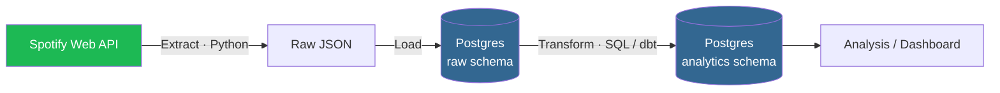

# spotify-elt-pipeline

> An ELT pipeline that extracts personal listening data from the Spotify Web API, lands it raw in Postgres, and transforms it into an analytics-ready data model.


> **Status:** 🚧 Actively building. See the [Roadmap](#roadmap) for what's done and what's next.

---

## Overview

This project answers a simple question with a real data engineering workflow: **what do my listening habits actually look like over time?**

It's built as an **ELT** pipeline rather than ETL — raw data is loaded into Postgres first, then transformed *inside* the warehouse with SQL. This mirrors how modern analytics stacks work (load cheap, transform in-warehouse, keep raw data replayable) and keeps the extraction layer dumb and reliable.

The whole stack runs locally via Docker Compose, so it can be cloned and stood up with a single command.

## Architecture



**Extract** — Python client pulls endpoints like recently-played tracks, top tracks/artists, and audio features.
**Load** — raw API responses land in a `raw` schema with minimal processing, so extraction never loses data and is fully replayable.
**Transform** — SQL/dbt models clean and reshape the raw data into a dimensional model (`dim_track`, `dim_artist`, `fact_plays`).
**Serve** — analytics tables ready for queries, notebooks, or a dashboard.

## Tech Stack

| Layer | Tool | Why |
|---|---|---|
| Extraction | Python 3.11 | Spotify API client, scheduling glue |
| Storage / Warehouse | Postgres 15 | Reliable, SQL-native, easy to run in Docker |
| Transformation | dbt *(planned)* | Versioned, tested, modular SQL transforms |
| Infrastructure | Docker Compose | Reproducible local environment |
| Orchestration | cron → Airflow/Dagster *(later)* | Scheduled, observable runs |

## Data Model

> 🚧 In progress. The target is a small star schema:

- `fact_plays` — one row per play event (track, timestamp, context)
- `dim_track` — track attributes + audio features (danceability, energy, tempo…)
- `dim_artist` — artist attributes and genres

Schema DDL lives in [`sql/ddl/`](sql/ddl/).

## Project Structure

```
spotify-elt-pipeline/
├── docker-compose.yml      # Postgres service (+ more later)
├── .env.example            # template for required env vars (no secrets)
├── .gitignore
├── requirements.txt
├── src/
│   ├── extract/            # Spotify Web API clients
│   ├── load/               # land raw responses in Postgres
│   └── transform/          # SQL / dbt models
├── sql/
│   └── ddl/                # schema + table definitions
├── tests/
└── README.md
```

## Getting Started

### Prerequisites
- [Docker Desktop](https://www.docker.com/products/docker-desktop/) — or, on macOS that predates Docker Desktop's requirements, [Colima](https://github.com/abiosoft/colima) (`brew install colima docker docker-compose`, then `colima start`). The `docker` / `docker compose` commands below work the same either way.
- Python 3.11+
- A [Spotify Developer app](https://developer.spotify.com/dashboard) (free) for your Client ID and Secret

### Setup

```bash
# 1. Clone
git clone https://github.com/<your-username>/spotify-elt-pipeline.git
cd spotify-elt-pipeline

# 2. Configure secrets (never committed — .env is gitignored)
cp .env.example .env
# then edit .env and fill in your Spotify + Postgres values

# 3. Start Postgres
docker compose up -d

# 4. Verify the database is up
docker compose exec postgres psql -U postgres -c "SELECT 1;"
```

### Environment variables

Copy `.env.example` to `.env` and fill in:

```env
SPOTIFY_CLIENT_ID=your_client_id
SPOTIFY_CLIENT_SECRET=your_client_secret
SPOTIFY_REFRESH_TOKEN=your_refresh_token   # added once OAuth is set up

POSTGRES_USER=postgres
POSTGRES_PASSWORD=postgres
POSTGRES_DB=spotify
POSTGRES_PORT=5432
```

> 🔒 `.env` is gitignored. Only `.env.example` (with placeholder values) is committed.

## Roadmap

**Phase 1 — Foundation** ✅
- [x] Postgres 15 running via Docker Compose
- [x] Repo + `.gitignore` + `.env.example` scaffolding
- [x] Spotify developer app registered, credentials in `.env`
- [x] `SELECT 1` succeeds against the container

**Phase 2 — Extract & Load**
- [ ] OAuth flow to obtain a refresh token
- [ ] Python client pulling recently-played + top tracks
- [ ] Raw responses landing in the `raw` schema (idempotent)

**Phase 3 — Transform**
- [ ] Star schema DDL (`dim_track`, `dim_artist`, `fact_plays`)
- [ ] dbt models + tests for the transformation layer

**Phase 4 — Operate & Present**
- [ ] Scheduled runs (cron, then an orchestrator)
- [ ] Simple dashboard or analysis notebook
- [ ] Sample insights + screenshots in this README

## Design Notes

A few decisions worth calling out:

- **ELT over ETL** — loading raw first means transforms are replayable and the warehouse owns the heavy lifting, which is the standard modern pattern.
- **Raw data is immutable** — the `raw` schema is append-only and never edited in place, so any transformation bug can be fixed and re-run without re-hitting the API.
- **Reproducibility** — everything runs from `docker compose up`, so the project behaves the same on any machine.

## License

MIT — see [LICENSE](LICENSE).
